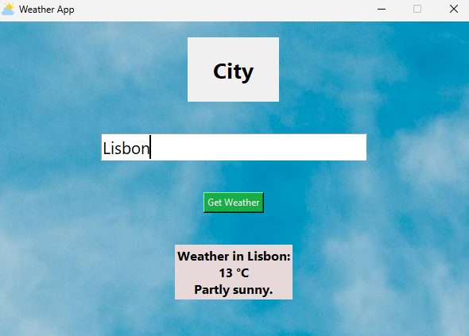

## Weather App

This app tells the weather in any city in Portugal. All you have to do is input the city and it will tell you the temperature and the description of the sky in that day according to the timeanddate.com website.

**Screenshot**

### Built With
 - Python 3.11.0
 - Tkinter (for the UI)
 - OOP principles

### Installation
 - Clone the repository
 - Navigate into the project folder
 - Run the application: main.py

### How It Works
You input a city in Portugal into the app and the script gets the weather from that city from the timeanddate.com website.

### Future Improvements
 - Add weather for all the cities in the world
 - Improve the UI
 - Fix the bug where when you press "Get weather" a weather from a non existent city appears
 
(No AI was directly used for the code in this project.)
